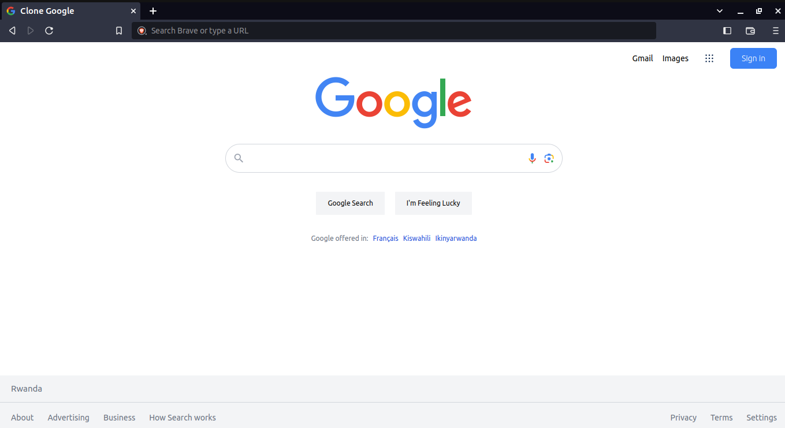

<h1>
GOOGLE SEARCH CLONE USING TAILWIND CSS
</h1>

This project is a recreation of the user interface of the Google search engine landing page. The goal of this project is to create a replica of the Google search page in terms of its visual appearance. This project is implemented using HTML5 and Tailwind CSS

<h3>Project Preview</h3>

